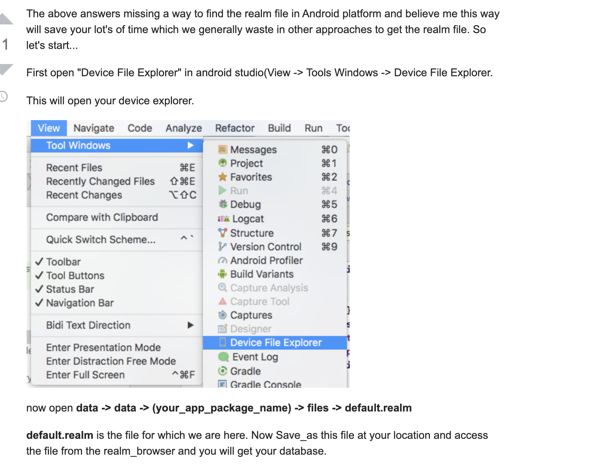

To access realmStudio with android

https://stackoverflow.com/questions/13006315/how-to-access-data-data-folder-in-android-device


```
adb shell

run-as com.your.packagename 

cp /data/data/com.your.packagename/

```

or visually 


